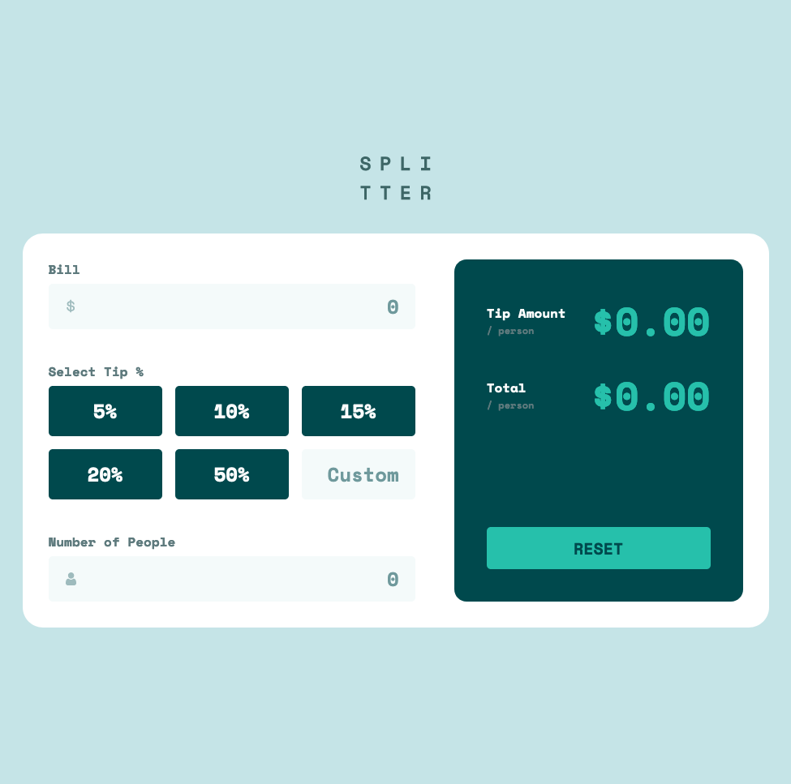
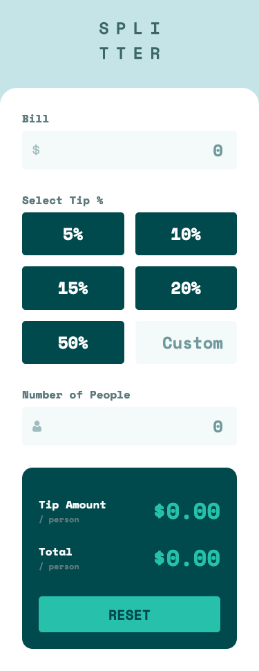

# Frontend Mentor - Tip calculator app solution

This is a solution to the [Tip calculator app challenge on Frontend Mentor](https://www.frontendmentor.io/challenges/tip-calculator-app-ugJNGbJUX). Frontend Mentor challenges help you improve your coding skills by building realistic projects.

## Table of contents

- [Overview](#overview)
  - [The challenge](#the-challenge)
  - [Screenshot](#screenshot)
  - [Links](#links)
- [My process](#my-process)
  - [Built with](#built-with)
  - [What I learned](#what-i-learned)
  - [Continued development](#continued-development)
  - [Useful resources](#useful-resources)
- [Author](#author)
- [Acknowledgments](#acknowledgments)

**Note: Delete this note and update the table of contents based on what sections you keep.**

## Overview

### The challenge

Users should be able to:

- View the optimal layout for the app depending on their device's screen size
- See hover states for all interactive elements on the page
- Calculate the correct tip and total cost of the bill per person

### Screenshot

### Links

- Solution URL: [Repository](https://github.com/jeancarlosruiz/tip-calculator-app/)
- Live Site URL: [Live Site](https://jeancarlosruiz.github.io/tip-calculator-app/)

## My process

### Built with

- Semantic HTML5 markup
- CSS custom properties
- Flexbox
- CSS Grid
- Mobile-first workflow
- [React](https://reactjs.org/) - JS library framework
- [Css Modules React](https://css-tricks.com/css-modules-part-1-need/) - For styles

### What I learned

### Continued development

### Useful resources

## Author

- Website - [Jean Carlos Ruiz (Portfolio)](https://www.your-site.com) (Building website)
- Frontend Mentor - [@jeancarlosruiz](https://www.frontendmentor.io/profile/jeancarlosruiz)

## Acknowledgments

More than grateful to these amazing people who have been helping me throughout this process and building my template based on their references:

- [Josh W Comeau](https://www.joyofreact.com/)
- [Desarrollo Útil](https://www.youtube.com/@DesarrolloUtil)
